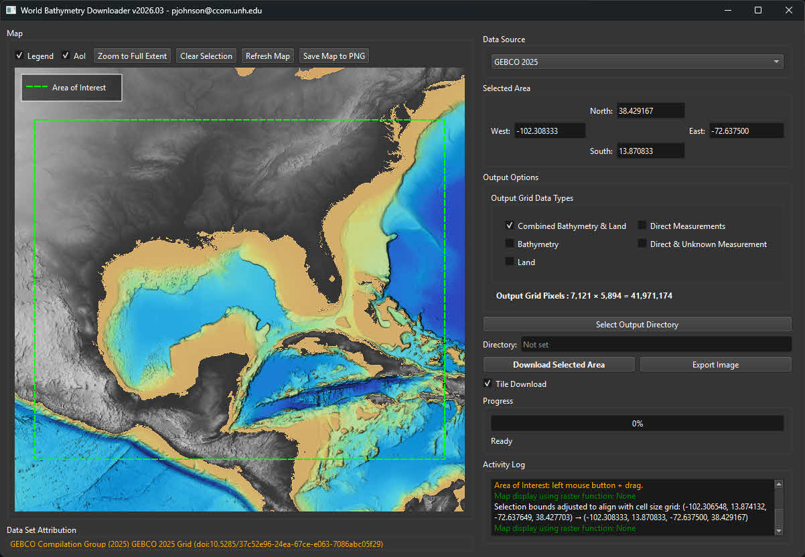

# World Bathymetry Downloader

A PyQt6-based desktop application for downloading bathymetry data from ArcGIS ImageServer REST endpoints and creating GeoTIFF files with interactive area selection.



## Overview

The World Bathymetry Downloader provides an intuitive graphical interface for selecting geographic areas and downloading bathymetry data from web-based data services. Supported sources currently include GEBCO (General Bathymetric Chart of the Oceans) and NOAA NCEI multibeam mosaics. The application supports multiple data sources and output formats, allowing users to extract specific subsets of bathymetry data based on measurement types.

### Data Set Attribution

When using GEBCO 2026 or GEBCO 2026 TID data, please cite:

**GEBCO Bathymetric Compilation Group 2026. The GEBCO_2026 Grid** ([doi:10.5285/4f68d5c7-45eb-f999-e063-7086abc036fa](https://doi.org/10.5285/4f68d5c7-45eb-f999-e063-7086abc036fa))

When using NCEI Multibeam Mosaic data, please cite NOAA National Centers for Environmental Information (NCEI).

## Features

### Interactive Map Interface
- **Interactive map widget** with area selection using mouse drag
- **GEBCO Land Grey basemap** for land visualization (display reference)
- **Bathymetry visualization** from MapServer or ImageServer display layers
- **Pan and zoom** functionality (middle mouse pan, mouse wheel zoom)
- **Zoom Prev / Zoom Next**: Restore previous or next map view and AOI from zoom history
- **Coordinate display** showing selected area bounds in WGS84 (EPSG:4326)
- Coordinate fields commit on Return or when focus leaves the selection group

### Data Sources

#### GEBCO 2026
- **Full global bathymetry dataset** with combined bathymetry and land elevation
- **Native resolution**: ~15 arc-seconds (~450 m at equator)
- **Coordinate system**: WGS84 (EPSG:4326)
- **Extent**: Global (-180° to 180° longitude, -90° to 90° latitude)
- **No-data**: Source ImageServer has no no-data areas; elevation 0 is valid data

#### GEBCO 2026 TID (Type Identifier Dataset)
- **Type identifier grid** indicating data source types
- **Same resolution and extent** as GEBCO 2026
- **Used for filtering** bathymetry data by measurement type when downloading GEBCO 2026 output types
- **No-data**: Source ImageServer has no no-data areas; TID 0 is land

#### NCEI Multibeam Mosaic Raw
- NOAA NCEI multibeam mosaic (raw)
- **Coordinate system**: WGS84 (EPSG:4326)
- **Configurable cell size** in degrees (defaults to native pixel size)
- **Bathymetry download only**; land layer is for map display reference
- **No-data**: Source has real no-data areas outside survey coverage (preserved in output)

#### NCEI Multibeam Mosaic Proc
- NOAA NCEI multibeam mosaic (processed)
- Same usage notes as the Raw mosaic (configurable cell size, land display underlay, preserved no-data)

### Output Options (GEBCO 2026 Only)

The **Output Options** panel contains an **Output Grid Data Types** groupbox (visible when GEBCO 2026 is selected) that allows you to select any combination of the following output types:

1. **Combined Bathymetry & Land** (default)
   - Complete grid with both bathymetry and land elevation values
   - No filtering applied

2. **Bathymetry Only**
   - Only cells where TID ≠ 0 (water/bathymetry areas)
   - Land cells are masked out

3. **Land Only**
   - Only cells where TID = 0 (land areas)
   - Bathymetry cells are masked out

4. **Direct Measurements Only**
   - Only cells where TID is 10-20 (direct measurement sources)
   - Extracts bathymetry values from direct measurement data

5. **Direct & Unknown Measurement Only**
   - Only cells where TID is 10-20, 44, or 70
   - Includes direct measurements and unknown measurement types

### File Output

- **Format**: GeoTIFF with LZW compression
- **Data types**:
  - GEBCO 2026: Signed 16-bit integer
  - GEBCO 2026 TID: Signed 8-bit integer
  - NCEI mosaics: Float32 (source no-data preserved where present)
- **Coordinate system**: WGS84 (EPSG:4326)
- **Automatic filename generation** with timestamp
- **Multiple file support**: When multiple GEBCO output options are selected, each generates a separate GeoTIFF file

### User Interface

The application interface is organized into several panels:

- **Left Panel**:
  - **Map Panel**: Interactive map display with Legend and AoI checkboxes, and buttons (Zoom Prev, Zoom Next, Zoom to Full Extent, Clear Selection, Refresh Map, Save Map to PNG)
  - **Data Set Attribution**: Groupbox below the map showing dataset citation with clickable link (orange text)
- **Right Panel**: Contains controls and information
  - **Data Source**: Dropdown to select GEBCO 2026, GEBCO 2026 TID, NCEI Multibeam Mosaic Raw, or NCEI Multibeam Mosaic Proc
  - **Selected Area**: Coordinate display and editing (West, South, East, North)
  - **Output Options**: Contains:
    - **Output Grid Data Types** groupbox (visible for GEBCO 2026): Checkboxes for selecting output types
    - **Cell Size (deg)** field (visible for NCEI sources)
    - **Pixel count display**: Shows number of pixels in selected area
  - **Output Directory**: Button and display for selecting save location
  - **Download button**: Initiates the download process
  - **Activity Log**: Real-time feedback, including REST endpoints used for map tiles and data downloads

### Additional Features

- **Bounds snapping**: Selected area automatically snaps to cell-size grid
- **Tile download support**: Handles large datasets by downloading in tiles
- **Progress tracking**: Real-time progress bar and activity log
- **Activity log**: Detailed logging of operations, including Service/Map/Data REST URLs
- **Data attribution**: Clickable citation link in the Data Set Attribution groupbox
- **Output directory selection**: Choose where to save downloaded files
- **Coordinate validation**: Ensures valid geographic bounds
- **Legend display**: Toggle legend visibility (enabled by default)
- **AoI display**: Toggle Area of Interest (selection rectangle) visibility (enabled by default). When AoI is unchecked, Legend is also unchecked; when AoI is re-enabled, Legend is restored if it was on before
- **Save Map to PNG**: Export the current map display to a PNG file (user chooses location and filename)
- **Startup map tips**: When the map first loads, the Activity Log shows a short tip in orange explaining how to Pan, Zoom, and Select an Area of Interest
- **Configuration**: The application saves settings (e.g. output directory) to `worldbathy_downloader_config.json` in the application directory
- **Dark theme**: The application uses the Qt Fusion style with a dark palette for a consistent look across Windows, macOS, and Linux

## Installation

### Requirements

- Python 3.8 or higher
- PyQt6
- rasterio
- numpy
- requests
- pyproj
- Pillow (PIL)

### Install Dependencies

```bash
pip install PyQt6 rasterio numpy requests pyproj Pillow
```

### Running the Application

```bash
python main.py
```

### Building an Executable

To create a standalone Windows executable (.exe) file:

1. **Ensure you're using the virtual environment Python**:
   - The build script (`build_exe.bat`) automatically uses Python from `C:\Users\pjohnson\PycharmProjects\.venv\Scripts\python.exe`
   - Make sure PyQt6 and all dependencies are installed in this virtual environment

2. **Install PyInstaller** (if not already installed in the virtual environment):
   ```bash
   C:\Users\pjohnson\PycharmProjects\.venv\Scripts\python.exe -m pip install pyinstaller
   ```

3. **Run the build script**:
   ```bash
   build_exe.bat
   ```
   
   Or manually run PyInstaller:
   ```bash
   C:\Users\pjohnson\PycharmProjects\.venv\Scripts\python.exe -m PyInstaller WorldBathy_Downloader.spec --clean --noconfirm
   ```

4. **Find the executable**: The built executable will be located in the `dist` folder as **WorldBathy_Downloader_v** followed by the version from `main.py` (e.g., `WorldBathy_Downloader_v2026.08.exe`)

The executable includes:
- All required dependencies bundled (PyQt6, rasterio, numpy, pyproj, etc.)
- The CCOM.ico icon from the `media` directory
- No console window (GUI-only application)
- Single-file distribution (all dependencies included)
- Version number automatically extracted from `main.py` and included in the filename

**Note**: The first build may take several minutes as PyInstaller analyzes and bundles all dependencies. Subsequent builds are faster. The build script uses the `WorldBathy_Downloader.spec` file; the output executable is named **WorldBathy_Downloader_v** + version (e.g. `WorldBathy_Downloader_v2026.08.exe`) and includes necessary hidden imports for rasterio submodules.

### Building a Mac App

To create a macOS application (.app bundle):

1. **Prerequisites**: You must build on a Mac (macOS 10.13 or later)
   - Ensure Python 3.8+ is installed
   - Create and activate a virtual environment (recommended):
     ```bash
     python3 -m venv venv
     source venv/bin/activate
     ```
   - Install dependencies:
     ```bash
     pip install PyQt6 rasterio numpy requests pyproj Pillow pyinstaller
     ```

2. **Run the build script**:
   ```bash
   chmod +x build_exe.sh
   ./build_exe.sh
   ```
   
   Or manually run PyInstaller:
   ```bash
   pyinstaller WorldBathy_Downloader.spec --clean --noconfirm
   ```

3. **Find the app bundle**: The built app will be located in the `dist` folder with a versioned name (e.g., `WorldBathy_Downloader_v2026.08.app`)

**Mac-Specific Notes**:
- The app bundle is a directory that macOS treats as a single application
- On first launch, macOS may show a Gatekeeper warning (right-click → "Open" → "Open")
- For distribution, consider code signing and notarization (see `BUILD_MAC_APP.md` for details)
- The spec file uses a `.ico` icon file; for better Mac integration, convert to `.icns` format

For detailed Mac build instructions, troubleshooting, and distribution guidelines, see `BUILD_MAC_APP.md`.

## Usage

### Selecting an Area

1. **Choose Data Source**: Select GEBCO 2026, GEBCO 2026 TID, NCEI Multibeam Mosaic Raw, or NCEI Multibeam Mosaic Proc from the dropdown
2. **Select Area**: Click and drag on the map to draw a selection rectangle
3. **Adjust Coordinates**: Manually edit West, South, East, North coordinates if needed (press Return or leave the fields to apply)
4. **View Selection**: The selected area is highlighted on the map

### Downloading Data

#### For GEBCO 2026:

1. **Select Output Grid Data Types**: In the "Output Grid Data Types" groupbox, check one or more of:
   - Combined Bathymetry & Land
   - Bathymetry Only
   - Land Only
   - Direct Measurements Only
   - Direct & Unknown Measurement Only
   
   Note: The "Output Grid Data Types" groupbox is only visible when "GEBCO 2026" (not "GEBCO 2026 TID") is selected as the data source.

2. **Choose Output Location**:
   - **Single file**: If only one option is selected, you can choose a specific filename via save dialog
   - **Multiple files**: If multiple options are selected, you must select an output directory

3. **Enable Tile Download** (optional): Check "Tile Download" for large areas

4. **Click Download**: The application will:
   - Download the main bathymetry grid
   - Download TID grid if needed for filtering
   - Apply masks based on selected options
   - Generate GeoTIFF file(s) with appropriate naming

#### For GEBCO 2026 TID:

1. Select output directory or filename
2. Click Download
3. A single GeoTIFF file is generated

#### For NCEI Multibeam Mosaic Raw / Proc:

1. Optionally set **Cell Size (deg)** (defaults to the service native pixel size)
2. Select output directory or filename
3. Click Download
4. A single bathymetry GeoTIFF is generated (land underlay is display-only)

### Activity Log

The Activity Log provides real-time feedback on operations:
- **Startup tip** (in orange): When the map first loads, a short message explains how to Pan (middle mouse + drag), Zoom (mouse wheel), and Select an Area of Interest (left mouse + drag)
- **REST endpoints**: Logs service metadata, map tile/export URLs, and download `exportImage` URLs
- **Bold messages** appear when TID-based extraction options are selected
- Progress updates during download
- Error messages if issues occur
- Success confirmation when downloads complete

### Map Controls

- **Legend**: Toggle legend visibility (checked by default)
- **AoI**: Toggle Area of Interest (selection rectangle) visibility (checked by default). Unchecking AoI also unchecks Legend; re-checking AoI restores Legend if it was on before
- **Zoom Prev**: Restore the previous map view and AOI (if available)
- **Zoom Next**: Move forward in zoom history after using Zoom Prev
- **Zoom to Full Extent**: Zoom map to show full dataset extent
- **Clear Selection**: Remove current area selection
- **Refresh Map**: Reload map display
- **Save Map to PNG**: Save the current map display to a PNG file; a save dialog lets you choose the location and filename

### Data Attribution

The **Data Set Attribution** groupbox appears below the Map panel and displays:
- Dataset citation text for the active source
- Clickable link (orange text) that opens the citation or service page in your web browser
- Attribution text updates automatically when switching between data sources

## File Naming Convention

Files are automatically named with the following pattern:

- **GEBCO 2026**: `GEBCO_2026_<mode_name>_<timestamp>.tif`
  - Mode name mappings (shortened names):
    - `combined` → `GEBCO_2026_combined_2026-09-14_14-30-45.tif`
    - `bathymetry` → `GEBCO_2026_bathymetry_2026-09-14_14-30-45.tif` (from "Bathymetry Only")
    - `land` → `GEBCO_2026_land_2026-09-14_14-30-45.tif` (from "Land Only")
    - `direct` → `GEBCO_2026_direct_2026-09-14_14-30-45.tif` (from "Direct Measurements Only")
    - `direct_unknown` → `GEBCO_2026_direct_unknown_2026-09-14_14-30-45.tif` (from "Direct & Unknown Measurement Only")

- **GEBCO 2026 TID**: `GEBCO_2026_TID_<timestamp>.tif`
  - Example: `GEBCO_2026_TID_2026-09-14_14-30-45.tif`

- **NCEI Multibeam Mosaic Raw**: `multibeam_mosaic_raw_<cell_size>deg_<timestamp>.tif`
- **NCEI Multibeam Mosaic Proc**: `multibeam_mosaic_processed_<cell_size>deg_<timestamp>.tif`

**Timestamp Format**: All filenames include `YYYY-MM-DD_HH-MM-SS` format (e.g., `2026-09-14_14-30-45`)

## Technical Details

### Coordinate Systems
- **Input/Output**: WGS84 (EPSG:4326) - Geographic Coordinate System
- **Internal processing**: Maintains geographic coordinates throughout

### Data Types and No-Data

- **GEBCO 2026**: Signed 16-bit integer
  - Source ImageServer has no no-data areas
  - Elevation 0 is a valid value and is preserved
  - Combined grids are written without inventing no-data for valid zeros
  - Masked outputs (Bathymetry Only, Land Only, Direct, etc.) use nodata only where TID filtering removes cells

- **GEBCO 2026 TID**: Signed 8-bit integer
  - Source ImageServer has no no-data areas
  - TID 0 means land (valid value)

- **NCEI Multibeam Mosaic Raw / Proc**: Float32
  - Source ImageServers include real no-data areas outside survey coverage
  - Export requests use `noData=true` and source no-data is preserved in the output GeoTIFF

### TID Values

The Type Identifier Dataset (TID) indicates the source type of each grid cell. The following values are used:

| TID | Definition |
|-----|------------|
| **0** | Land |
| **Direct measurements** | |
| 10 | Singlebeam – depth value collected by a single beam echo-sounder |
| 11 | Multibeam – depth value collected by a multibeam echo-sounder |
| 12 | Seismic – depth value collected by seismic methods |
| 13 | Isolated sounding – depth value that is not part of a regular survey or trackline |
| 14 | ENC sounding – depth value extracted from an Electronic Navigation Chart (ENC) |
| 15 | Lidar – depth derived from a bathymetric lidar sensor |
| 16 | Depth measured by optical light sensor |
| 17 | Combination of direct measurement methods |
| **Indirect measurements** | |
| 40 | Predicted based on satellite-derived gravity data – depth value is an interpolated value guided by satellite-derived gravity data |
| 41 | Interpolated based on a computer algorithm – depth value is an interpolated value based on a computer algorithm (e.g. Generic Mapping Tools) |
| 42 | Digital bathymetric contours from charts – depth value taken from a bathymetric contour data set |
| 43 | Digital bathymetric contours from ENCs – depth value taken from bathymetric contours from an Electronic Navigation Chart (ENC) |
| 44 | Depth value at this location is based on bathymetric depths from multiple sources including measured and derived data and included within a gridded data set where interpolation between sounding points is guided by satellite-derived gravity data |
| 45 | Predicted based on helicopter/flight-derived gravity data |
| 46 | Depth estimated by calculating the draft of a grounded iceberg using satellite-derived freeboard measurement |
| 47 | Depth derived from grounded Argo float data |
| **Unknown** | |
| 70 | Pre-generated grid – depth value is taken from a pre-generated grid that is based on mixed source data types, e.g. single beam, multibeam, interpolation etc. |
| 71 | Unknown source – depth value from an unknown source |
| 72 | Steering points – depth value used to constrain the grid in areas of poor data coverage |

*GEBCO Grid, vertical and horizontal datum.*

## License

BSD 3-Clause License

Copyright (c) 2025–2026, Center for Coastal and Ocean Mapping, University of New Hampshire
All rights reserved.

See LICENSE file for full license text.

## Author

Paul Johnson  
Center for Coastal and Ocean Mapping  
University of New Hampshire

## Version History

- **2026.08** - GEBCO 2026 / GEBCO 2026 TID as default sources; NCEI Multibeam Mosaic Raw and Proc; Zoom Prev/Next history; Activity Log REST endpoint logging; GEBCO vs NCEI no-data handling; AOI/map letterboxing fix; taller attribution area
- **2026.03** - Added Fusion dark mode (consistent across platforms), light palette for matplotlib windows, attribution text in orange, exe naming WorldBathy_Downloader_v + version
- **2026.2** - Enhanced with multiple output types, data attribution, improved UI, WorldBathy naming (executable and config), and executable build improvements
- **2026.1** - First release

## Support

For issues, questions, or contributions, please contact the Center for Coastal and Ocean Mapping at the University of New Hampshire.
